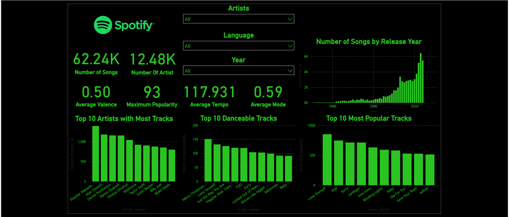

# Spotify Music Analytics Dashboard

## Overview
This Power BI dashboard provides insights into Spotify's extensive music dataset, analyzing trends and patterns across various metrics. It is designed to be interactive and user-friendly, offering a detailed exploration of music statistics and visualizations.

## Features

### Key Metrics
- **Number of Songs**: 62.24K
- **Number of Artists**: 12.48K
- **Maximum Popularity**: 93
- **Average Tempo**: 117.93
- **Average Valence**: 0.50
- **Average Mode**: 0.59

### Visualizations
- **Top 10 Artists with Most Tracks**
- **Top 10 Danceable Tracks**
- **Top 10 Most Popular Tracks**
- **Number of Songs by Release Year**

### Filters
The dashboard includes slicers for:
- **Artist**
- **Language**
- **Release Year**

## Objectives
This project aims to analyze Spotify's dataset to uncover:
- Music trends by year.
- The most prolific artists.
- Popular tracks based on metrics such as popularity and danceability.
- Insights into average tempo, valence, and mode of tracks.

## Tools Used
- **Power BI**: For creating interactive dashboards.
- **Spotify Dataset**: The source data for this analysis.

## Repository Contents
- **`dashboard.png`**: A preview image of the dashboard.
- **`Spotify Dashboard.pbix`**: The Power BI project file.
- **Dataset**: [spotify_tracks.csv](./spotify_tracks.csv)

## How to Use
1. Download the Power BI file (`Spotify Dashboard.pbix`).
2. Open it in Power BI Desktop to view or customize the dashboard.

If you find this project useful, please give it a ⭐ and feel free to contribute!
